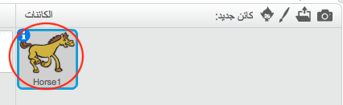
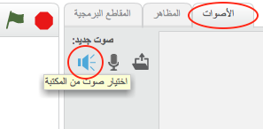
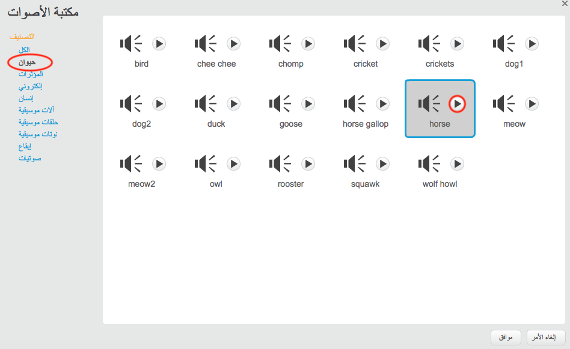
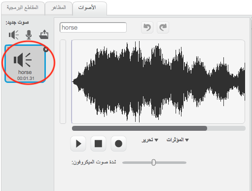

+ حدِّد الكائن الذي تريد إضافة صوت إليه.
    
    

+ انقر فوق علامة التبويب **الأصوات**، ثم انقر فوق **اختيار صوت من المكتبة**:
    
    

+ الأصوات مرتَّبة حسب الفئة، ويمكنك النقر فوق الزر **تشغيل** لسماع الصوت. اختر صوتًا مناسبًا وانقر فوق **موافق**.
    
    

+ ستجد عندئذٍ أنه أصبح للكائن الصوت الذي اخترتَه.
    
    