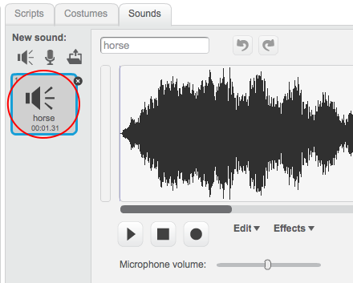

+ যে স্প্রাইটের জন্য শব্দ যোগ করতে চান সেই স্প্রাইটকে সিলেক্ট করুন।
    
    

+ ক্লিক করুন ** Sounds ** ট্যাবটিতে এবং ক্লিক করুন ** Choose sound from library **:
    
    

+ সাউন্ডগুলো ক্যাটাগরি অনুযায়ী সাজানো আছে, আপনি **Play** বাটনে ক্লিক করে সাউন্ড শুনতে পারবেন। আপনার পছন্দ অনুযায়ী উপযুক্ত শব্দ নির্বাচন করুন এবং **OK** বাটনে ক্লিক করুন।
    
    

+ এরপর আপনি দেখতে পাবেন যে আপনার নির্বাচিত শব্দ সঠিকভাবে আপনার পছন্দ করা স্প্রাইটে যোগ হয়েছে।
    
    