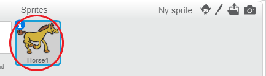
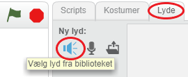
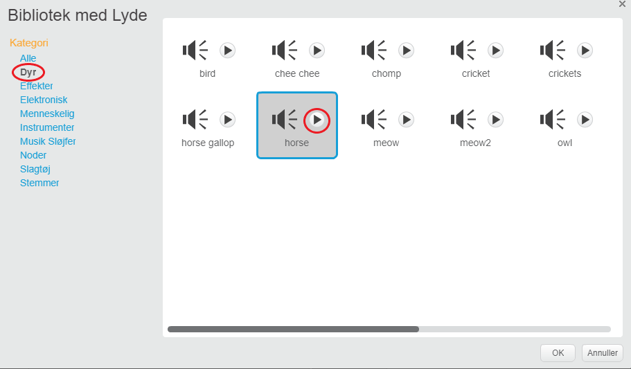
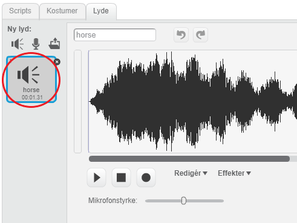

+ Vælg sprite du vil føje lyden til.
    
    

+ Klik på fanen **Lyde** , og klik på **Vælg lyd fra bibliotek**:
    
    

+ Lyde er organiseret efter kategori, og du kan klikke på **Play** knappen for at høre en lyd. Vælg en passende lyd og klik på **OK**.
    
    

+ Du kan se hvilke lyd, der er valgt til din sprite.
    
    