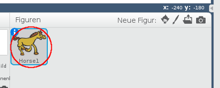
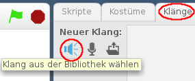
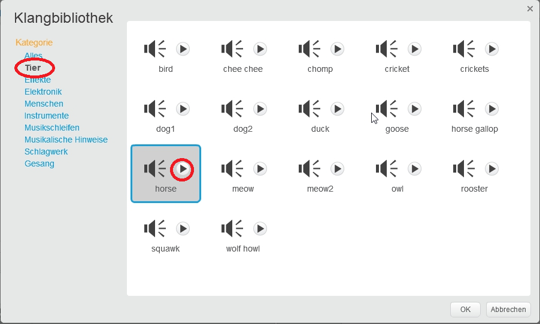
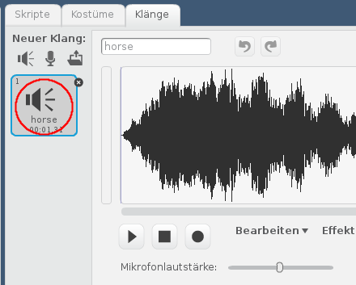

+ Wähle die Figur aus, der du den Klang hinzufügen möchtest.
    
    

+ Klicke auf den Reiter **"Klänge"** und klicke auf **"Klang aus der Bibliothek wählen"**:
    
    

+ Die Klänge sind nach Kategorie sortiert und du kannst das **Wiedergabe-Symbol** anklicken um einen Klang zu hören. Wähle einen geeigneten Klang und klicke auf **OK**.
    
    

+ Du solltest dann sehen, dass deine Figur den von dir gewählten Klang hat.
    
    