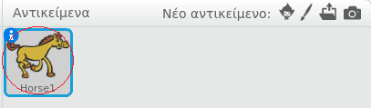
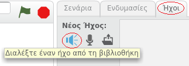
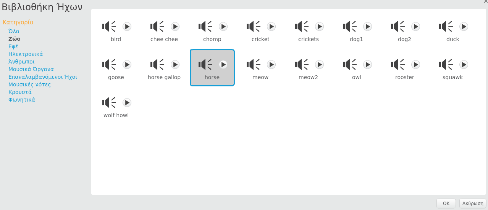

+ Επέλεξε το αντικείμενο στο οποίο θέλεις να προσθέσεις τον ήχο.
    
    

+ Κάνε κλικ στην καρτέλα **Ήχοι** και ξανά κλικ στο **Διαλέξτε έναν ήχο από τη βιβλιοθήκη**:
    
    

+ Οι ήχοι είναι οργανωμένοι ανά κατηγορία και μπορείς να κάνεις κλικ στο κουμπί **Play** για να ακούσεις τον ήχο. Διάλεξε έναν κατάλληλο ήχο και κάνε κλικ στο **OK**.
    
    

+ Στη συνέχεια, θα πρέπει να δεις ότι το αντικείμενο έχει τον επιλεγμένο ήχο.
    
    