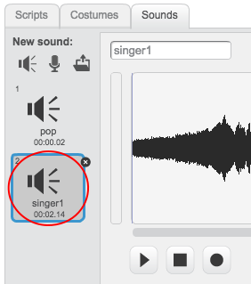

## Add a sound to your Scratch sprite

+ Select the sprite you want to add the sound to.

	

+ Click the 'Sounds' tab, and click 'Choose sound from library':

	

+ Sounds are organised by category, and you can click the 'play' button to hear a sound. Choose a suitable sound and click 'OK'.

	

+ You should then see that your sprite has your chosen sound.

	
