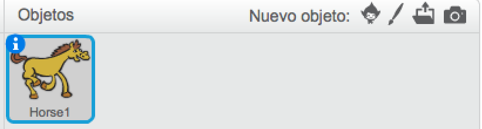
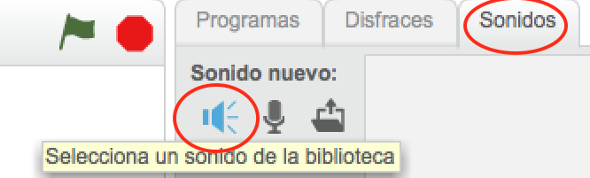
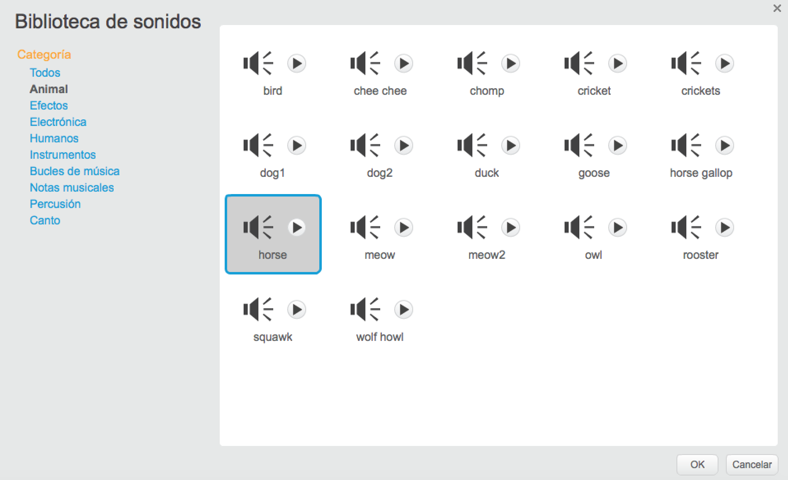
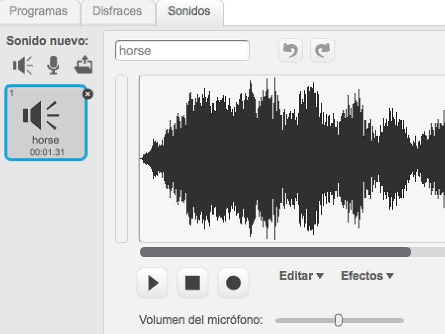

+ Selecciona el sprite al que deseas añadirle el sonido.
    
    

+ Haz clic en la pestaña de **Sonidos**, y después en **Elija un sonido de la biblioteca**:
    
    

+ Los sonidos están organizados por categoría, y puedes hacer clic en el botón de ** Comenzar ** para escuchar un sonido. Elige un sonido adecuado y haz clic en **OK**.
    
    

+ Deberías ver que tu sprite tiene el sonido que has elegido.
    
    