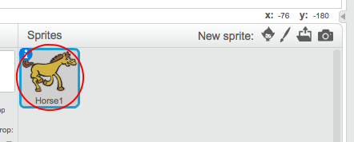

+ Selecciona el sprite al que deseas añadirle el sonido.
    
    

+ Click the **Sounds** tab, and click **Choose sound from library**:
    
    

+ Sounds are organised by category, and you can click the **Play** button to hear a sound. Choose a suitable sound and click **OK**.
    
    

+ Deberías ver que tu sprite tiene el sonido que has elegido.
    
    