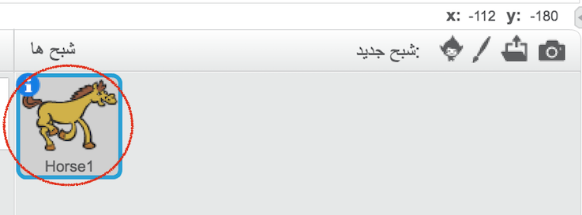
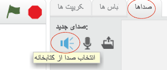
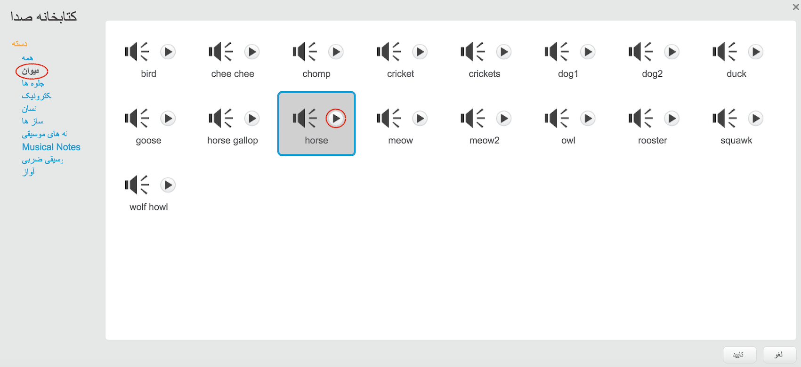
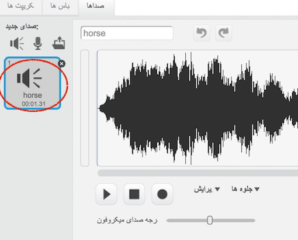

+ حدی که می خواهید صدا را اضافه کنید را انتخاب کنید
    
    

+ روی زبانه **Sounds** کلیک کنید و روی **کلیک کنید صدا را از کتابخانه** انتخاب کنید:
    
    

+ برای صداها بر اساس طبقه بندی سازماندهی شده است، و شما می توانید با کلیک بر روی دکمه **Play** برای شنیدن صدا. یک صدا مناسب را انتخاب کنید و روی **OK** کلیک کنید.
    
    

+ پس از آن باید ببینیم که جنبش شما دارای صدای انتخابی شما است.
    
    