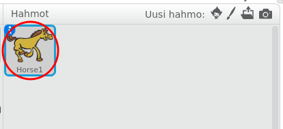
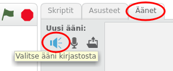
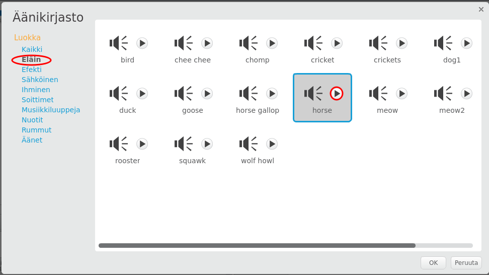
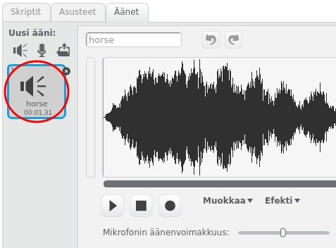

+ Valitse sprite, johon haluat lisätä äänen.
    
    

+ Klikkaa **Äänet** -välilehteä ja napsauta **Valitse ääni kirjastosta**:
    
    

+ Äänet on järjestetty luokan mukaan, ja voit kuulla äänen napsauttamalla **Toista** -painiketta. Valitse sopiva ääni ja napsauta **OK**.
    
    

+ Sinun pitäisi sitten nähdä, että spriteellesi on valittu ääni.
    
    