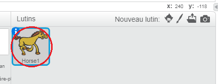
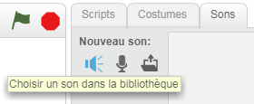
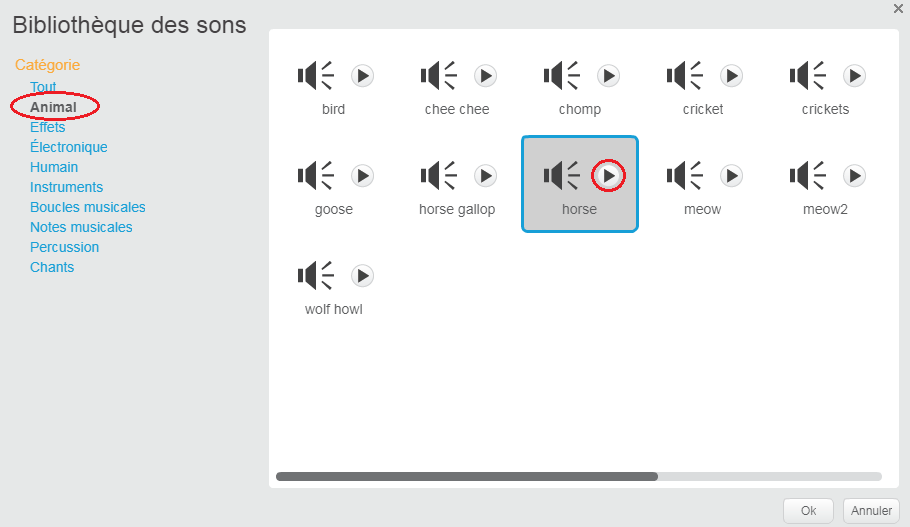
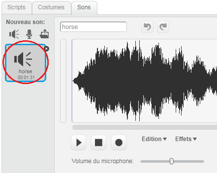

+ Sélectionnez le lutin auquel vous souhaitez ajouter le son.
    
    

+ Cliquez sur le | 123_8_0_321 | Sons | 123_9_1_321 | onglet, et cliquez sur | 123_8_2_321 | Choisir le son de la bibliothèque | 123_9_3_321 |:
    
    

+ Les sons sont organisés par catégorie et vous pouvez cliquer sur | 123_8_0_321 | Play | 123_9_1_321 | bouton pour entendre un son. Choisissez un son approprié et cliquez sur | 123_8_2_321 | OK | 123_9_3_321 |.
    
    

+ Vous devriez alors voir que votre sprite a votre son choisi.
    
    