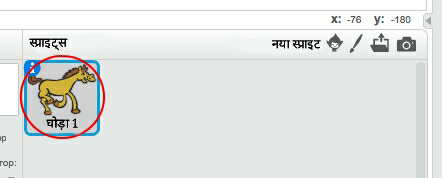
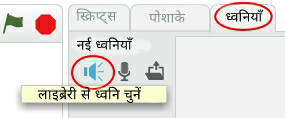
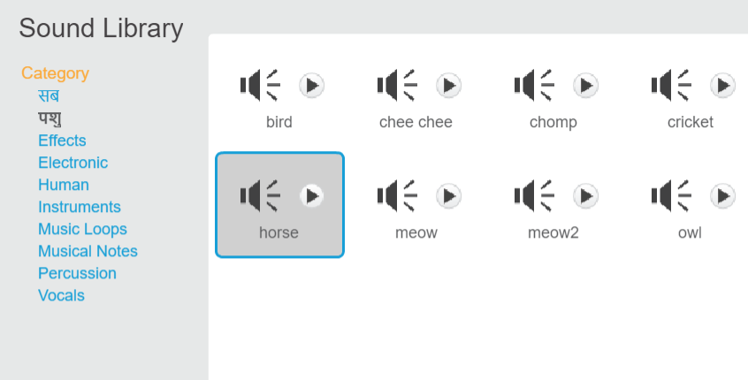
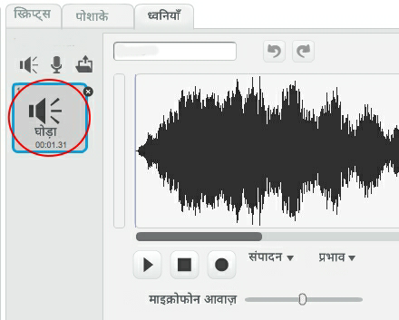

+ उस स्प्राइट का चयन करें जिससे आप ध्वनि जोड़ना चाहते हैं।
    
    

+ **ध्वनि** टैब पर क्लिक करें, और **लाइब्रेरी से ध्वनि चुने** पर क्लिक करें:
    
    

+ Sounds are organised by category, and you can click the **Play** button to hear a sound. Choose a suitable sound and click **OK**.
    
    

+ You should then see that your sprite has your chosen sound.
    
    