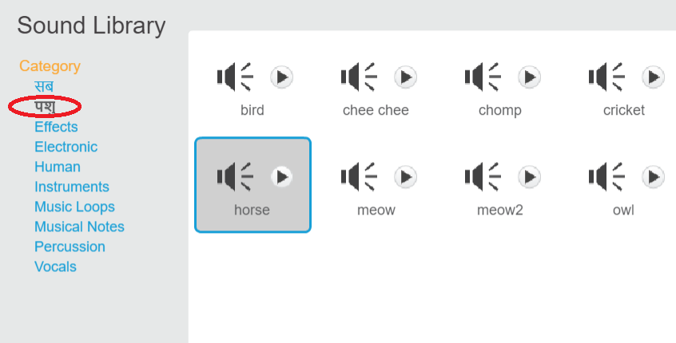

+ उस स्प्राइट का चयन करें जिससे आप ध्वनि जोड़ना चाहते हैं।
    
    

+ **Sounds** टैब पर क्लिक करें, और **Choose sound from library** पर क्लिक करें:
    
    

+ ध्वनियाँ श्रेणी में व्यवस्थित होती हैं, और आप ध्वनि सुनने के लिए **चलाए(Play)** बटन पर क्लिक कर सकते हैं। उचित ध्वनि चुनें और **ठीक(OK)** पर क्लिक करें।
    
    

+ इसके बाद आपको दिखना चाहिए कि आपके स्प्राइट में आपके द्वारा चुनी गई ध्वनि जुड़ गई है।
    
    