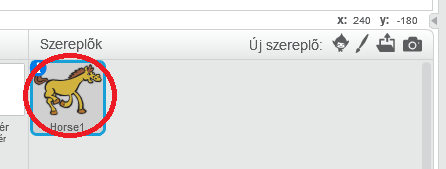
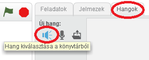
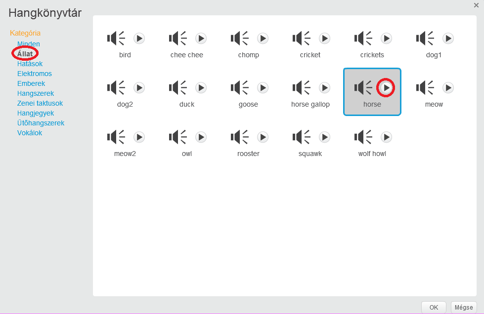
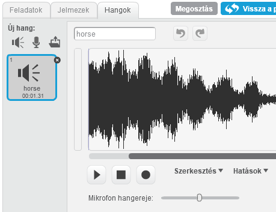

+ Válassza ki a hangot, amelyhez hozzá kívánja adni a hangot.
    
    

+ Kattintson a **Hangok** lapra, majd kattintson a **Válassza ki a hangot a könyvtárból**:
    
    

+ A hangok kategóriák szerint vannak rendezve, és a **Play** gomb megnyomásával hangot hallhatunk. Válasszon megfelelő hangot, és kattintson a **OK gombra**.
    
    

+ Ezután meg kell látnod, hogy a sprite-nek van választott hangja.
    
    