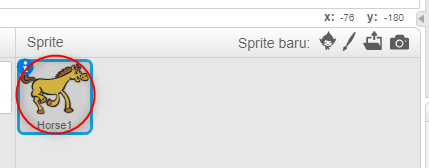
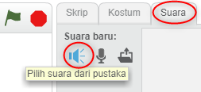
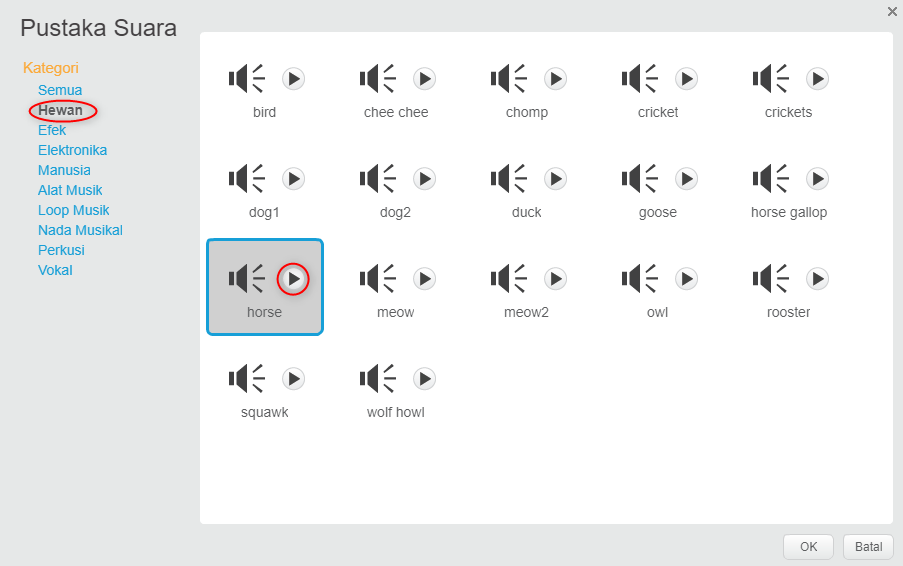
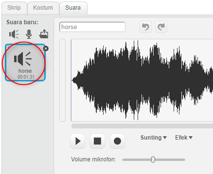

+ Pilih sprite yang ingin Kamu tambahkan suara.
    
    

+ Klik tab **Suara**, dan klik **Pilih suara dari pustaka**:
    
    

+ Suara dikelompokan berdasarkan kategori, dan Kamu bisa mengklik tombol **Putar** untuk mendengar suara. Pilih suara yang sesuai dan klik **OK**.
    
    

+ Kamu kemudian akan melihat bahwa sprite Kamu telah memiliki suara yang Kamu pilih.
    
    