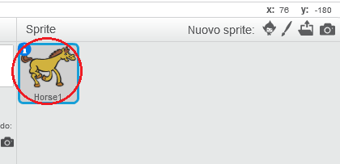
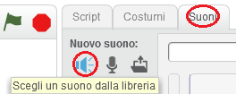
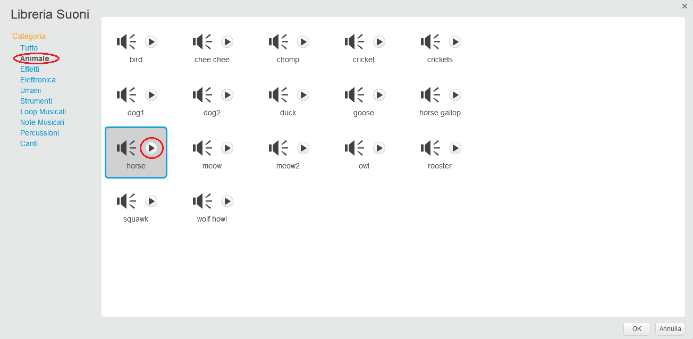
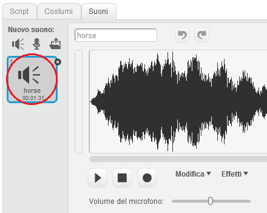

+ Seleziona lo sprite a cui vuoi aggiungere il suono.
    
    

+ Fai click sulla scheda **Suoni**, e clicca su **Scegli un suono dalla libreria**:
    
    

+ I suoni sono organizzati per categoria. Puoi fare clic sul pulsante **Play** per ascoltarne uno. Scegli un suono adatto e clicca **OK**.
    
    

+ Dovresti poter vedere che il tuo sprite ha il suono che hai scelto.
    
    