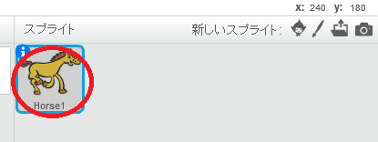
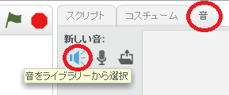
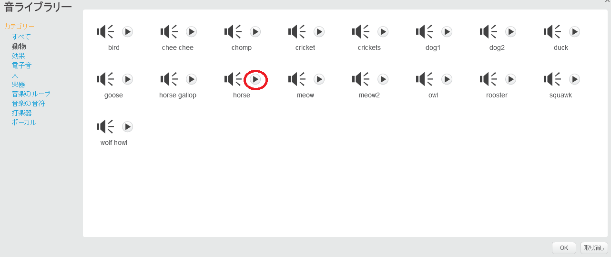
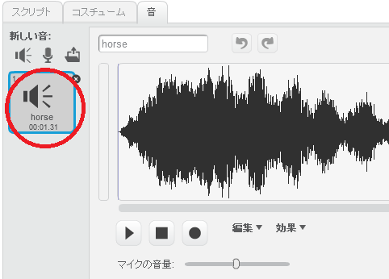

+ 音を追加したいスプライトを選択します。
    
    

+ **音** タブをクリックし、 ** 音をライブラリーから選択** をクリックします：
    
    

+ 音はカテゴリー別に整理されており、 **再生** ボタンをクリックするとサウンドが聞こえます。適切な音を選択し、 **OK** をクリックします。
    
    

+ スプライトにあなたが選択した音が追加されていることがわかります。
    
    