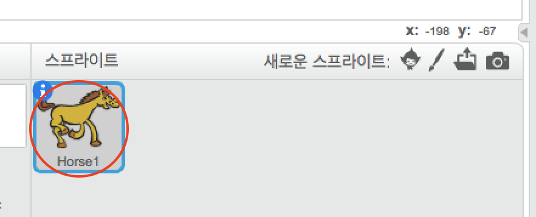
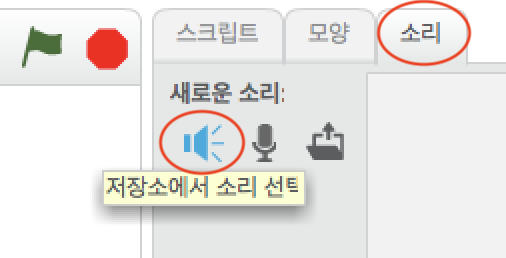
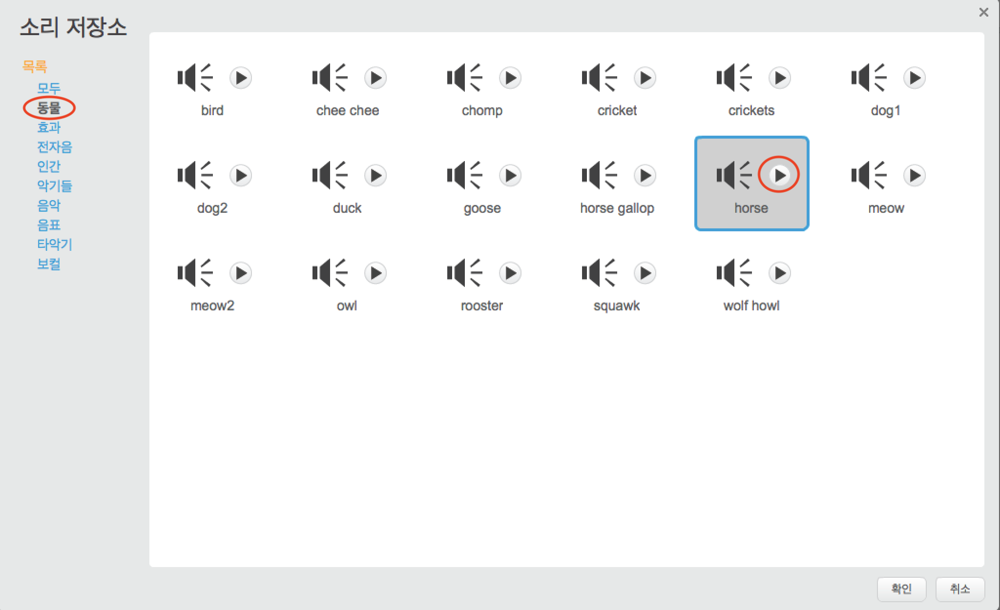
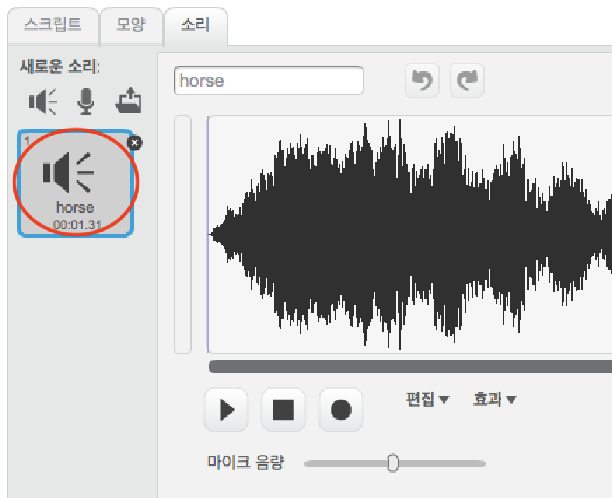

+ 사운드를 추가 할 스프라이트를 선택하세요.
    
    

+ **소리** 탭을 클릭하고 **라이브러리에서 소리 선택**을 클릭하세요:
    
    

+ 사운드는 카테고리별로 구성되며 **재생** 버튼을 클릭하면 사운드를들을 수 있습니다. 적절한 사운드를 선택하고 **OK**을 클릭하십시오.
    
    

+ 그러면 스프라이트에 선택한 사운드가 있음을 확인해야합니다.
    
    