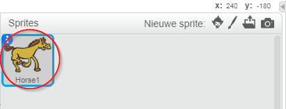
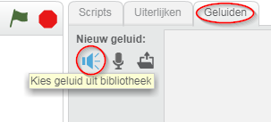
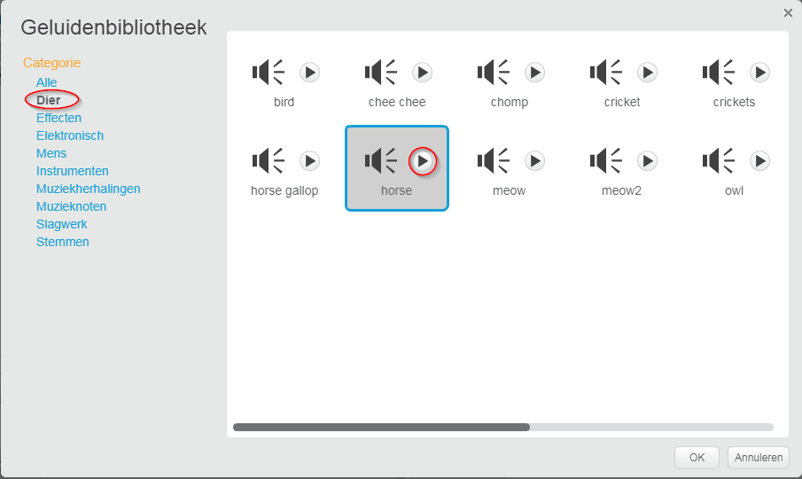
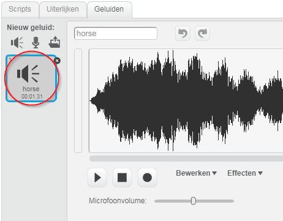

+ Selecteer de sprite waaraan u het geluid wilt toevoegen.
    
    

+ Klik op het tabblad **Geluiden** en klik op **Kies geluid uit bibliotheek**:
    
    

+ Geluiden zijn ingedeeld per categorie en u kunt op de knop **** klikken om een ​​geluid te horen. Kies een geschikt geluid en klik op **OK**.
    
    

+ Je zou dan moeten zien dat je sprite het door jou gekozen geluid heeft.
    
    