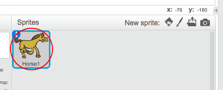
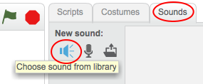
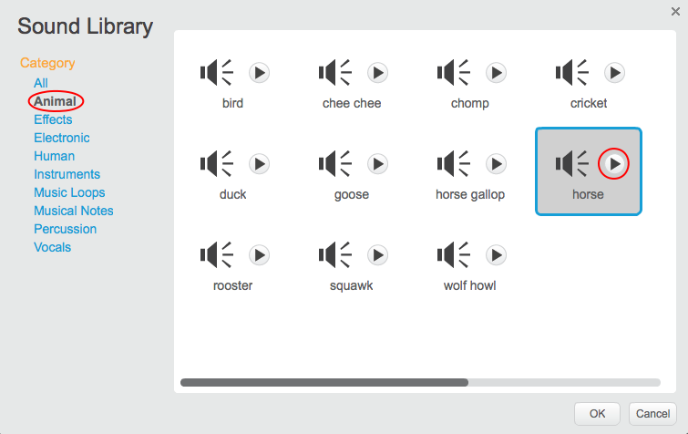

+ Velg sprite du vil legge til lyden til.
    
    

+ Klikk kategorien **Lyder** , og klikk **Velg lyd fra bibliotek**:
    
    

+ Lyder er organisert etter kategori, og du kan klikke **Play** knappen for å høre en lyd. Velg en passende lyd og klikk **OK**.
    
    

+ Du bør da se at sprite har din valgte lyd.
    
    