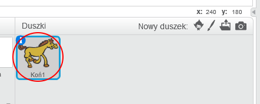
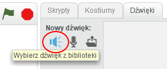
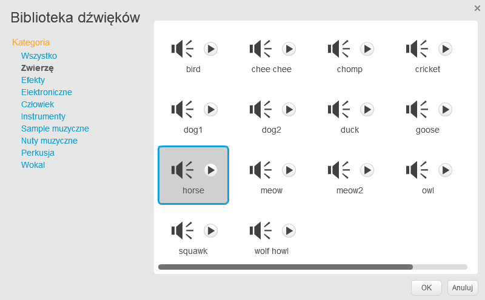
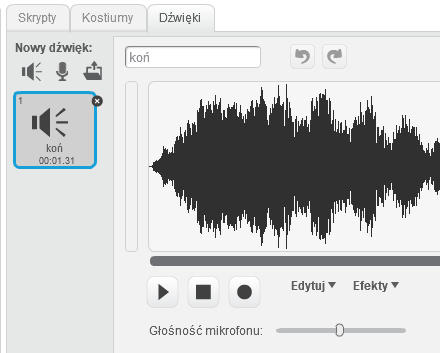

+ Wybierz duszka, do którego chcesz dodać dźwięk.
    
    

+ Kliknij kartę **Dźwięki**, a następnie **Wybierz dźwięk z biblioteki**:
    
    

+ Dźwięki uporządkowane są według kategorii i możesz kliknąć przycisk **Odtwórz**, aby usłyszeć dźwięk. Wybierz odpowiedni dźwięk i kliknij **OK**.
    
    

+ Powinieneś wtedy zobaczyć, że twój duszek ma wybrany przez ciebie dźwięk.
    
    