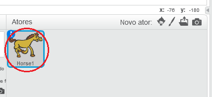
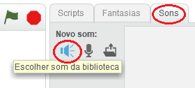
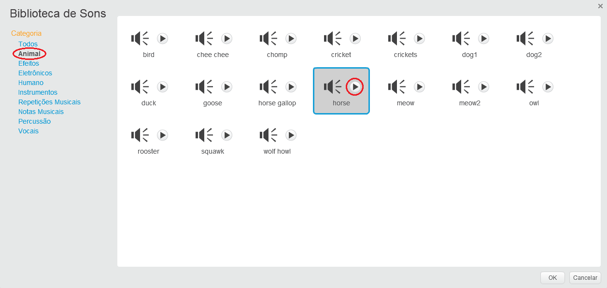
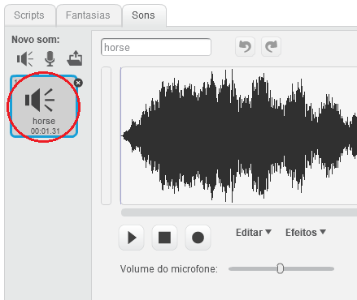

+ Selecione o ator ao qual deseja adicionar o som.
    
    

+ Clique na guia **Sons** e clique em **Escolher som da biblioteca**:
    
    

+ Os sons são organizados por categoria e você pode clicar no botão **Play** para ouvir um som. Escolha um som adequado e clique em **OK**.
    
    

+ Você deve então ver que seu ator possui o som escolhido.
    
    