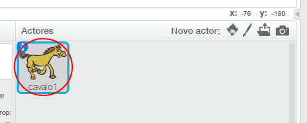
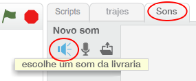
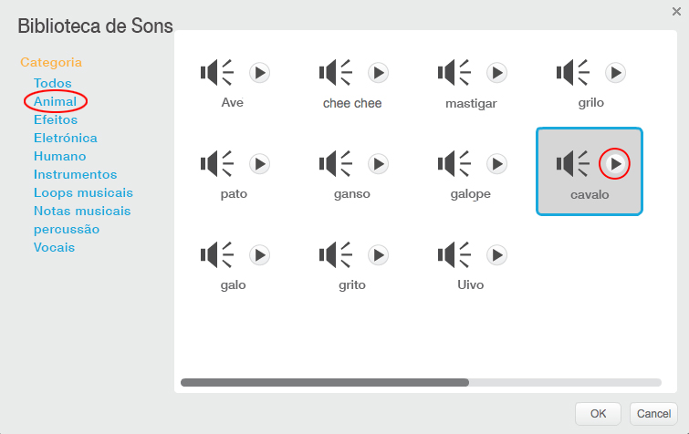
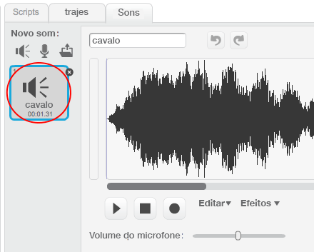

+ Selecione o actor ao qual deseja adicionar o som.
    
    

+ Clique no separador **Sons** e clique em **Escolha o som da livraria**:
    
    

+ Os sons estão organizados por categoria e podes clicar no botão **tocar** para ouvir um som. Escolhe um som adequado e clica em **OK**.
    
    

+ Nessa altura deves ver que o teu actor tem o som que escolheste.
    
    