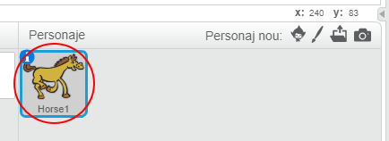
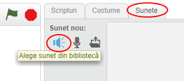
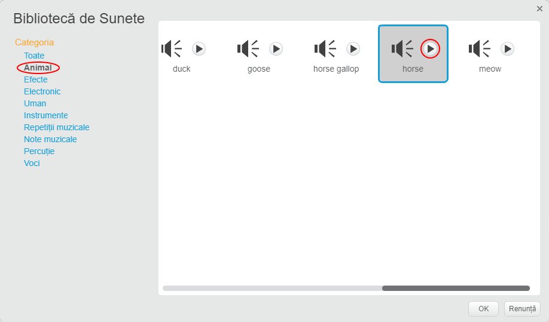
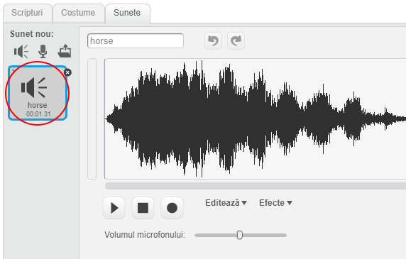

+ Selectați spriteul la care doriți să adăugați sunetul.
    
    

+ Faceți clic pe fila **Sunete** și faceți clic pe **Alegeți sunetul din bibliotecă**:
    
    

+ Sunetele sunt organizate pe categorii și puteți face clic pe butonul **Play** pentru a auzi un sunet. Alegeți un sunet potrivit și faceți clic pe **OK**.
    
    

+ Ar trebui să vezi că sprite-ul tău are sunetul tău ales.
    
    