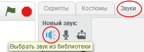
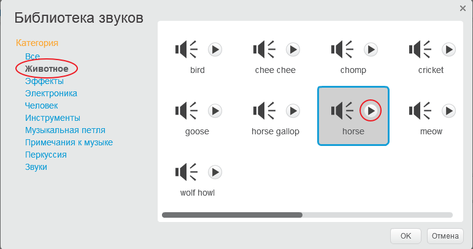
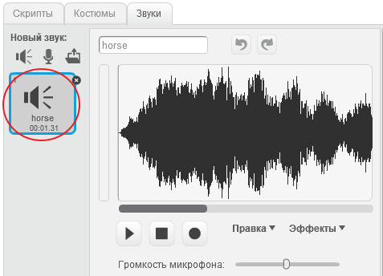

+ Выберите спрайт, к которому вы хотите добавить звук.
    
    

+ Перейди на вкладку **Звуки** и нажми кнопку **Выбрать звук из библиотеки**:
    
    

+ Звуки организованы по категориям. Если вы нажмёшь кнопку с **треугольником**, то сможете прослушать звук. Выберите нужный вам звук и нажмите **OK**.
    
    

+ Далее ваш спрайт должен получить выбранный вами звук.
    
    