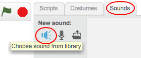

+ Изаберите сприте на који желите додати звук.
    
    

+ Кликните на картицу **звукови** и кликните на дугме **Изабери звук из библиотеке**:
    
    

+ Звукови су организовани по категоријама и можете кликнути на дугме **репродукција** да бисте чули звук. Изаберите одговарајући звук и кликните **ОК**.
    
    

+ Тада би требало да видите да ваш сприте има свој одабрани звук.
    
    