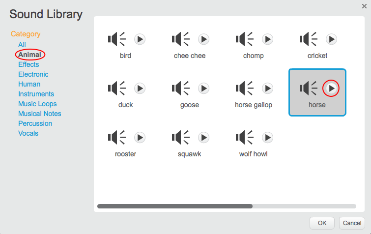

+ Välj sprite du vill lägga till ljudet på.
    
    

+ Klicka på fliken **Ljud** och klicka på **Välj ljud från biblioteket**:
    
    

+ Ljud sorteras efter kategori, och du kan klicka på **Play** knappen för att höra ett ljud. Välj ett lämpligt ljud och klicka på **OK**.
    
    

+ Du bör då se att din sprite har ditt valda ljud.
    
    