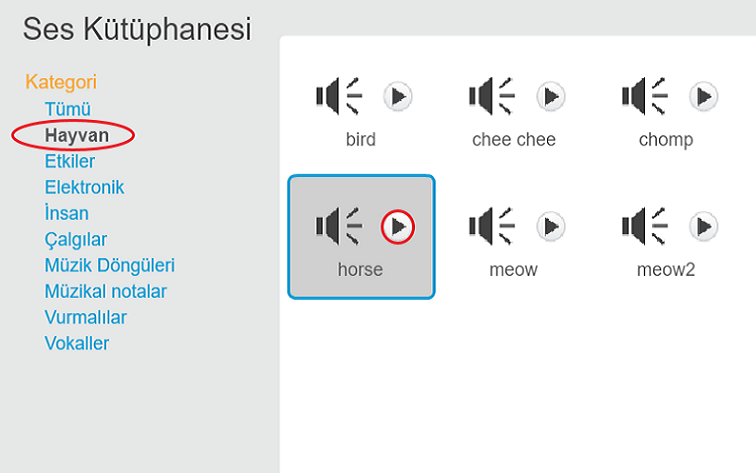

+ Ses eklemek istediğiniz kuklayı seçin.
    
    

+ **Sesler** sekmesine tıklayın ve **Sesi kütüphaneden seç**'e tıklayın:
    
    

+ Sesler kategoriye göre düzenlenir ve seslerden bir tanesini dinlemek için **Oynat** düğmesine tıklayabilirsiniz. Uygun bir ses seçin ve **Tamam**'a tıklayın.
    
    

+ Ardından, kuklanızın seçtiğiniz sese sahip olduğunu görmelisiniz.
    
    