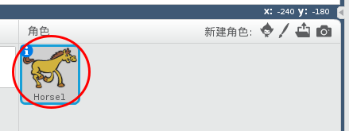
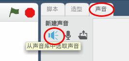
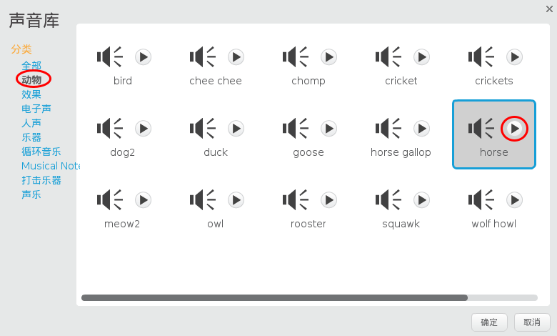
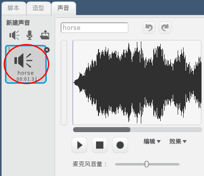

+ 选择你想要添加声音的角色。
    
    

+ 单击**声音**标签，然后单击 **从声音库中选取声音**图标:
    
    

+ Sounds are organised by category, and you can click the **Play** button to hear a sound. Choose a suitable sound and click **OK**.
    
    

+ 你应该看到你的角色已经有了你刚给它选的声音。
    
    